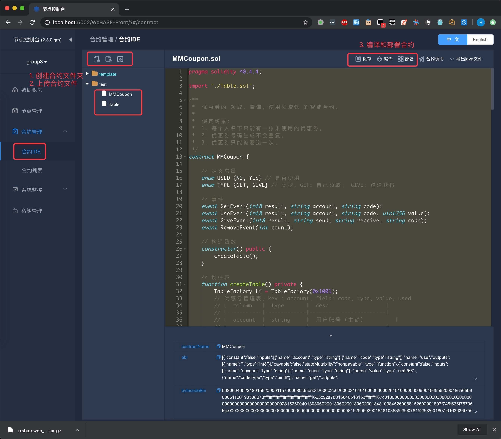

# 部署合约

部署合约是指，将 `solidity` 语言编写的合约代码进行编译，然后调用部署方法，将合约代码上传到区块链上。只有合约通过部署到链上后，SDK 和应用程序才能进行调用。

部署合约的三种方式：
* 控制台（console）部署
* SDK 部署
* （**推荐使用**）可视化（WeBASE-Front）部署

```eval_rst
.. admonition:: 提示

     - SDK 部署需要使用控制台（console）中的 `sol2java.sh` 脚本来生成对应的 Java 文件，只需要部署控制台（console）服务，不需要运行；
```


## 控制台（console）

* 登录一台节点主机，部署 控制台（console）服务
* 上传合约到指定的目录
* 启动 console
* 调用部署指令

部署控制台应用，请参考：[部署和启动控制台](https://fisco-bcos-documentation.readthedocs.io/zh_CN/latest/docs/console/console_of_java_sdk.html#id2)

合约部署和调用，请参考：[控制台部署合约](https://fisco-bcos-documentation.readthedocs.io/zh_CN/latest/docs/console/console_of_java_sdk.html#id15)


## SDK
* 登录一台节点主机，部署 console
* 上传合约到指定的目录
* 执行编译脚本 `contracts/sdk/sol2java.sh`，使用包名（比如：org.fisco.xxx）做参数，生成 Java 文件
* 导入 Java 文件到工程，依赖 web3j SDK
* 编写 Java 代码，通过 web3j SDK 提供的方法部署合约

关于如何使用合约编译工具，请参考：[合约编译工具](https://fisco-bcos-documentation.readthedocs.io/zh_CN/latest/docs/console/console_of_java_sdk.html#id5)

合约编译工具操作示例，请参考：[合约编译工具的示例](https://fisco-bcos-documentation.readthedocs.io/zh_CN/latest/docs/tutorial/sdk_application.html#id7)

## 可视化（WeBASE-Front）

* 登录一台节点主机，部署并启动 WeBASE-Front
* 在浏览器输入地址：http://[IP]:5002/WeBASE-Front/#/home
* 选择群组编号，然后点击左侧的合约管理，打开合约 IDE

关于 WeBASE-Front 的部署，请参考：[部署 WeBASE-Front](https://webasedoc.readthedocs.io/zh_CN/latest/docs/WeBASE-Front/install.html)


* 创建合约文件夹，上传合约文件
* 指定点击编译和部署按钮，如下图：




